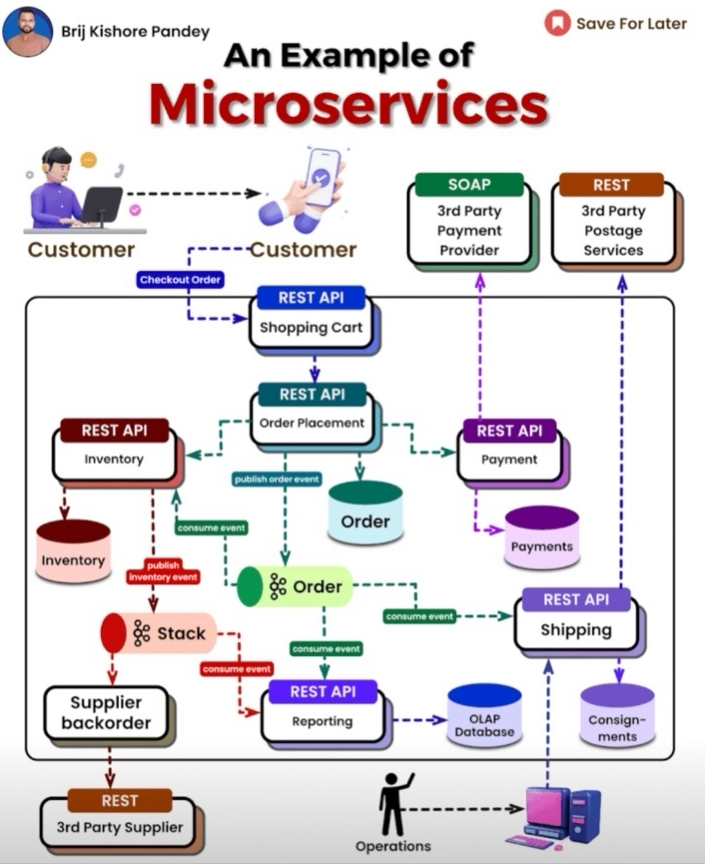

# MicroShop - Microservices E-Commerce Platform

## Overview

MicroShop is a microservices-based e-commerce platform built with Golang. The architecture follows Clean Architecture principles and utilizes REST/gRPC for service communication, event-driven design with Kafka, and containerized deployment using Docker and Kubernetes.


## Tech Stack

- **Programming Language**: Golang
- **API Framework**: Gin / Fiber (REST) & gRPC
- **Database**: PostgreSQL + GORM
- **Message Queue**: Kafka / RabbitMQ
- **Authentication**: JWT / OAuth2 (Keycloak / Auth0)
- **API Gateway**: Kong / Traefik / Custom API Gateway
- **Logging**: Zerolog / Logrus
- **Deployment**: Docker, Kubernetes, GitHub Actions (CI/CD)

## Project Structure

```
microshop/                # Root of the Monorepo
│── api-gateway/          # API Gateway (Kong / Traefik / Custom API Gateway)
│── services/             # All Microservices
│   │── order-service/    # Order Management Service
│   │── inventory-service/ # Stock & Inventory Management
│   │── payment-service/  # Payment Handling
│   │── shipping-service/ # Shipping & Logistics
│── pkg/                  # Shared Packages (Utilities, Configs, Protobuf, etc.)
│── deploy/               # K8s / Docker Compose Configs
│── configs/              # Environment Variable Configs
│── Makefile              # Build and Run Commands
│── docker-compose.yml    # Docker Compose for Dev Environment
│── README.md             # Documentation
```
